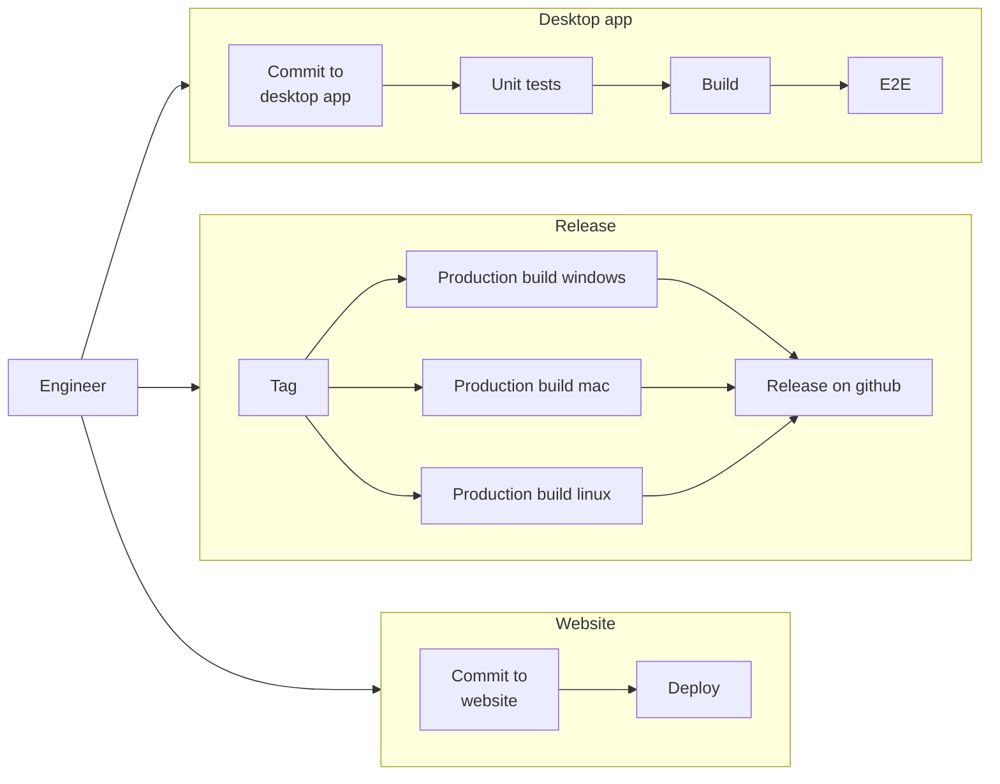

# GitHub Actions Kata

Welcome to a hands-on introduction to GitHub Actions through a simple kata. The aim of this exercise is to improve programming skills by collaboratively building a CI/CD pipeline for a straightforward application.

## Introduction to Kata

Kata, a term originating from Japanese culture, means "form". In the context of programming, it refers to an exercise designed to enhance your abilities through practice and repetition. You can learn more about Kata at [CodeKata](http://codekata.com/).

## Kata Outline

This kata is divided into seven tasks, organized into two main phases: setting up a Continuous Integration (CI) pipeline followed by establishing a Continuous Deployment (CD) pipeline. It's advisable to complete these tasks in order, as each one builds upon the previous one.

### Tasks

1. Configure repository and run first action - [Task 1](./task-1/README.md)
2. Run unit tests on PR - [Task 2](./task-2/README.md)
3. Optimize job to run only on \*.js changes - [Task 3](./task-3/README.md)
4. Run E2E tests on PR - [Task 4](./task-4/README.md)
5. Website preview deployment - [Task 5](./task-5/README.md)
6. Application release - [Task 6](./task-6/README.md)
7. Be creative - [Task 7](./task-7/README.md)

## Repository Structure

The repository is organized, with each task located in its own folder. Each task folder contains a README.md file with the task description. Additionally there are three additional folders: `desktop-app`, `website` and `templates`. In `desktop-app` there is electron application that will be used in tasks 2, 3, 4 and 6. In the `website` folder, there is a website that will be used in task 5. In `templates` folder are templates that you can use in your actions.

There are several branches included in this repository. The `main` branch contains the initial setup of the repository. For each task there is `task-*-solution` branch that contains the solution for that task. You can use these branches to check for hints and working solutions. Before doing that, try to solve the task on your own.

## Getting Started

1. Fork this repository
2. Clone the forked repository to your machine
3. Go to the first task folder and read the README.md file
4. Create branch `task-1` and start working on the task
5. After you finish the task, create a PR to the `main` branch

## What will you build?

## GitHub Actions Pricing

GitHub Actions is free for public repositories. For private repositories, up to 2000 **Linux** minutes per month are available at no charge. For detailed pricing information, visit the [GitHub Actions billing page](https://docs.github.com/en/billing/managing-billing-for-github-actions/about-billing-for-github-actions). Working on a public fork of this repository is recommended.

[Pricing calculator](https://github.com/pricing/calculator)

## Contribution Guidelines

- To propose a new task, **open an issue**.
- To report errors or suggest enhancements, **open an issue or a PR**.
- To share a better solution for a task, **submit a PR**.

## License

The contents of this repository, including code and tasks, are under the MIT license. For the complete license text, refer to the [LICENSE](./LICENSE) file.
