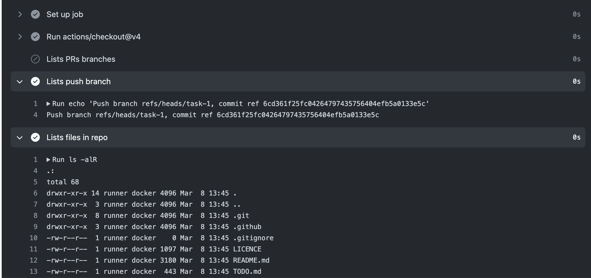

# Task 1

Time to warm up. In your first task you will create a GitHub action that prints basic information about itself and then lists all the files that are currently in the repository

## Definition of done

- [ ] Action displays the branch and commit ref
- [ ] Action lists the files that are in the repository

**_ Remember to create a new branch for this task _**

## Hints & help

 Those hints will help you start

- [Quickstart](https://docs.github.com/en/actions/quickstart)
- GitHub action template in [templates](../templates) folder
- Use `push` event trigger - [other events](https://docs.github.com/en/actions/using-workflows/events-that-trigger-workflows)
- Use linux os - [operating systems](https://docs.github.com/en/actions/using-github-hosted-runners/about-github-hosted-runners/about-github-hosted-runners#standard-github-hosted-runners-for-public-repositories)
- Before listing files, first checkout the code `actions/checkout@v4`

If you want to learn and experiment more, you can use the following resources:

- [Action workflow syntax](https://docs.github.com/en/actions/learn-github-actions/understanding-github-actions#create-an-example-workflow) - detail explanation of each of the fields in the workflow file
- [Github context](https://docs.github.com/en/actions/learn-github-actions/contexts#github-context) - provides information about the GitHub job and event as variables
- [ENV variables provided by GitHub](https://docs.github.com/en/actions/learn-github-actions/variables#default-environment-variables)
- [Understanding GitHub Actions](https://docs.github.com/en/actions/learn-github-actions/understanding-github-actions)

Here is an example solution for this task:

- [PR with ready solution](https://github.com/Ubax/github-actions-kata/pull/1)

