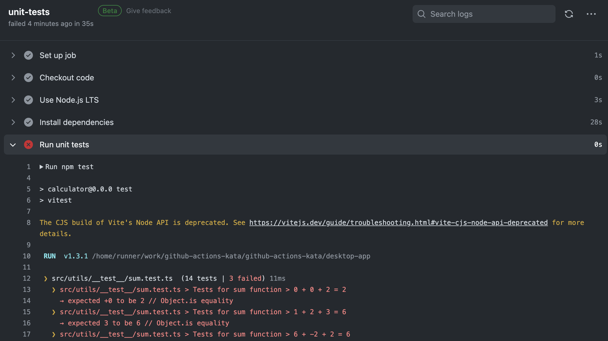
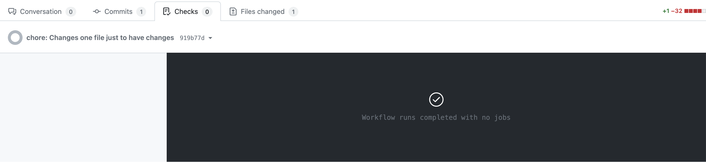

# Task 2

Now your task is to run all the unit tests when the PR is created. 
The unit tests are located in the `desktop-app` folder. To run them you need to install the dependencies (`npm install`) and then run the tests (`npm test`). In the CI environment it is recommend to install dependencies by using [`npm ci`](https://docs.npmjs.com/cli/v9/commands/npm-ci).

Since the tests were not run regularly they may be broken. Fix them to be able to merge your branch.

## Definition of Done

- [ ] Unit tests are run when new commit is pushed to the branch with PR
- [ ] When unit tests are not passing, the job should fail
- [ ] Unit tests are run on latest LTS version of node
- [ ] Node dependencies are cached
- [ ] Tests for the `desktop-app` are fixed and are passing

Pipeline with failing unit tests:

There should be no pipeline for PRs to branches different then main

## Hints & help

Those hints will help you start

- [actions/setup-node@v4](https://github.com/actions/setup-node)
- `npm ci`
- `npm test`
- [Setting working directory](https://docs.github.com/en/actions/using-workflows/workflow-syntax-for-github-actions#jobsjob_idstepsworking-directory) - default working directory is the root of the repository
- Use `pull_request` event trigger - [other events](https://docs.github.com/en/actions/using-workflows/events-that-trigger-workflows)
- [Example of Node.js workflow](https://docs.github.com/en/actions/guides/building-and-testing-nodejs)
- [setting setting for all jobs](https://docs.github.com/en/actions/using-workflows/workflow-syntax-for-github-actions#defaults)

Here is an example solution for this task:
-  [PR with ready solution](https://github.com/Ubax/github-actions-kata/pull/2)

